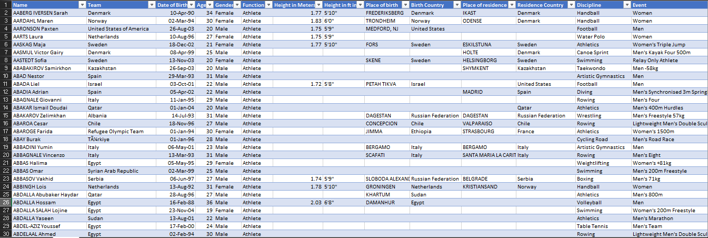
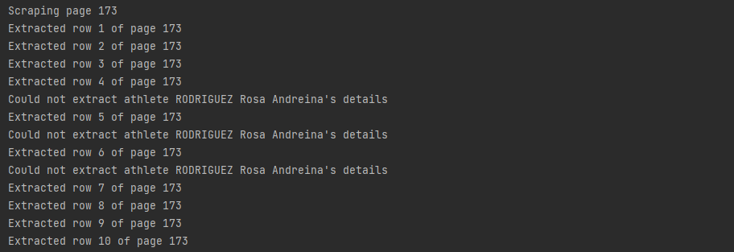
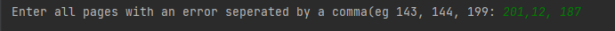

# 2024-olympics-athlete-selenium-scraper
## Overview
This project is a Python web scraper using Selenium designed to extract detailed athlete data from Olympics.com. It captures a variety of attributes for each athlete and saves the data into a CSV file for analysis.

The scraper collects the following information for each athlete:
* Name: The full name of the athlete.
* Team: The country the athlete represents.
* Date of Birth: The athlete's date of birth.
* Age: The athlete's age as of 2024 olympics.
* Gender: The athlete's gender (e.g. Male, Female).
* Function: The role of the athlete (e.g. Athlete, Alternate Athlete).
* Height in Meters: The athlete's height in meters.
* Height in ft in: The athlete's height in feet and inches.
* Place of Birth: The city or place where the athlete was born.
* Birth Country: The country where the athlete was born.
* Place of Residence: The city or place where the athlete currently resides.
* Residence Country: The country where the athlete currently resides.
* Discipline: The sport or discipline the athlete competes in (e.g. Athleics, Handball, Football).
* Event: The specific event within the sport or discipline (e.g. Women’s Handball, Men’s Football, Men's Triple Jump).<br><br>


## Files
1. requirements.txt: Lists the Python packages required for the project.
2. main.py: Contains the main code for scraping athlete data.
3. rescrape.py: Contains code for rescraping specific pages where data extraction was incomplete.

## Installation
1. Clone the repository:

```
git clone https://github.com/Derrick-Mulwa/2024-olympics-athlete-selenium-scraper
```
2. Navigate to the project directory:

```
cd path_to_directory
```
3. Install the required dependencies:

```
pip install -r requirements.txt
```

## How to Use
### Initial Scraping
Run the main scraper:

```
python main.py
```

- This will start the scraper and collect data from the website.
- The extracted data will be saved as data.csv in the same directory as main.py.

### Handling Errors and Re-scraping
#### Identify Errors:

During the execution of main.py, check the console output for any errors or indications of partially scraped pages.<br><br>


#### Run the rescraper:

If there are specific pages where data was not scraped successfully, use the rescrape.py script to target those pages:

```
python rescrape.py
```
This script will attempt to rescrape the specific pages and complete the data extraction for those athletes.



## Contributing
Contributions are welcome! Please open an issue or submit a pull request for improvements or bug fixes.

## License
This project is licensed under the MIT License.